# Intracranial Hemorrhage Detection
## Identify acute intracranial hemorrhage and its subtypes

**Author**: SHAILESH DHAMA
    
### GOAL/MOTIVE OF THE PROBLEM:

To build an algorithm to detect acute intracranial hemorrhage and its subtypes.

### Dataset: https://www.kaggle.com/c/rsna-intracranial-hemorrhage-detection/data

### Required Libraries:

    1.Numpy
    2.Pandas
    3.Matplotlib
    4.Seaborn
    5.Pydicom
    6.Scikit-image
    7.Scikit-learn
    8.Keras

## STEPS:

- Data Cleaning and Preprocessing
- Overview of DICOM files and medical images
- Data Visualisation
- Clustering subtypes of Intracranial Hemorrhage
    - Visualization of hemorrhage epidural
    - Visualization of hemorrhage intraparenchymal
    - Visualization of hemorrhage intraventricular
    - Visualization of hemorrhage subarachnoid
    - Visualization of hemorrhage subdural

## RESULTS :

#### Graphical Visualisations:

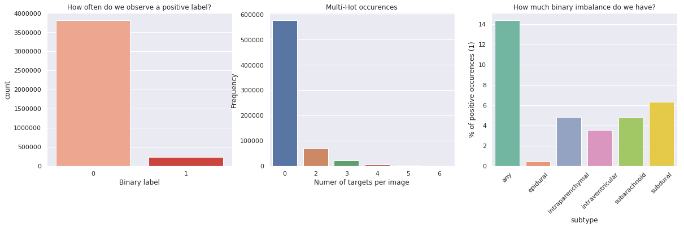
> Exploring categories graphically.

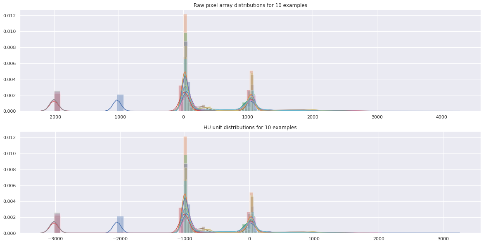
> Pixel Unit Distributions

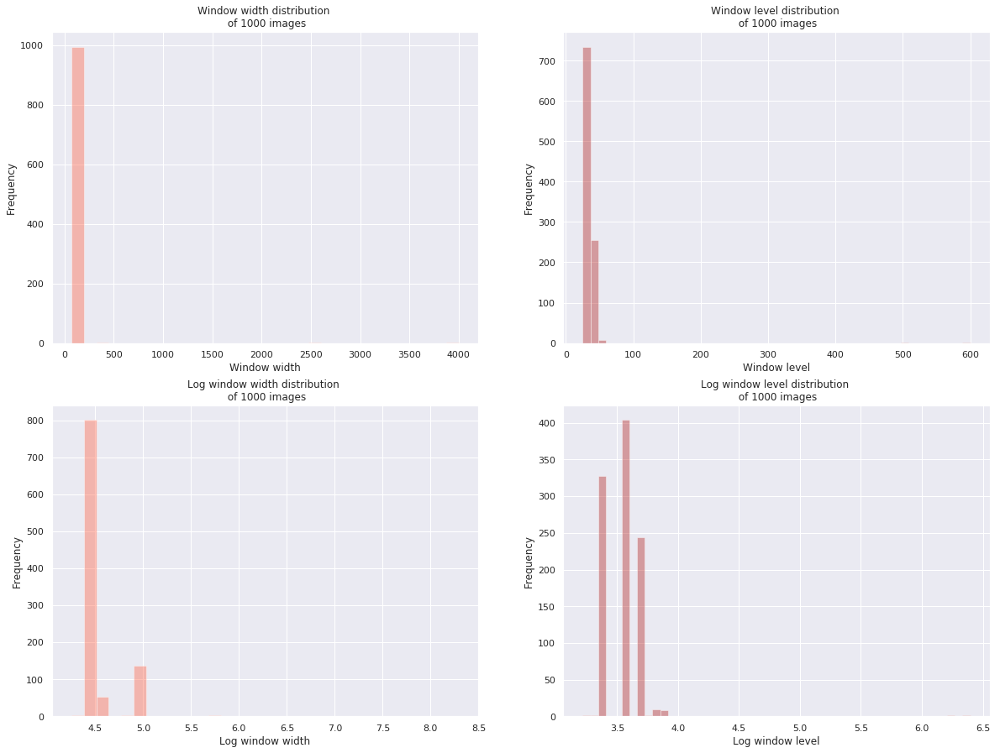
> Width DIstribution of Images

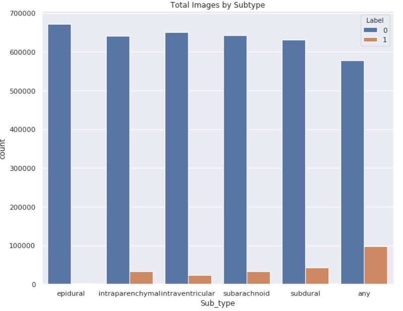
> Total Images by Subtype

#### Medical Images Visualisations:

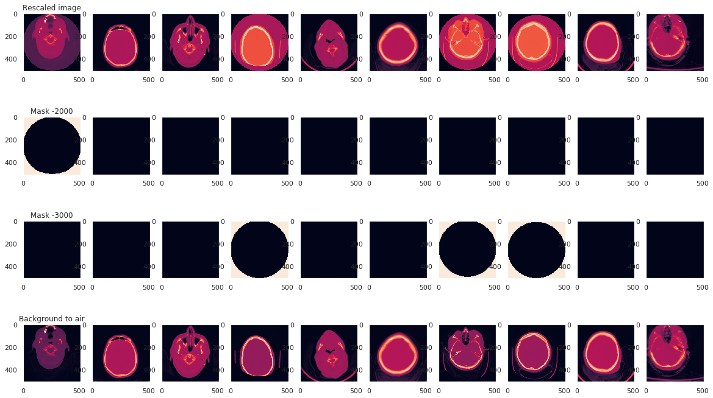
> Rescaling and masking of DICOM

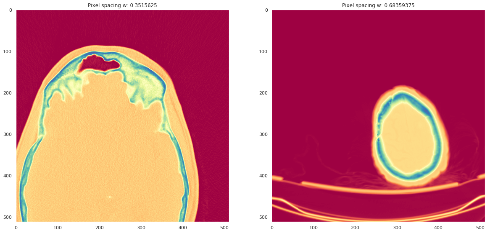
> Pixel spacing

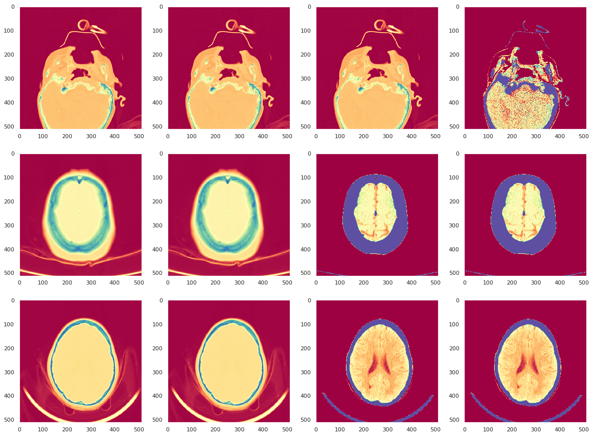
> DICOM representation using diverging colormaps

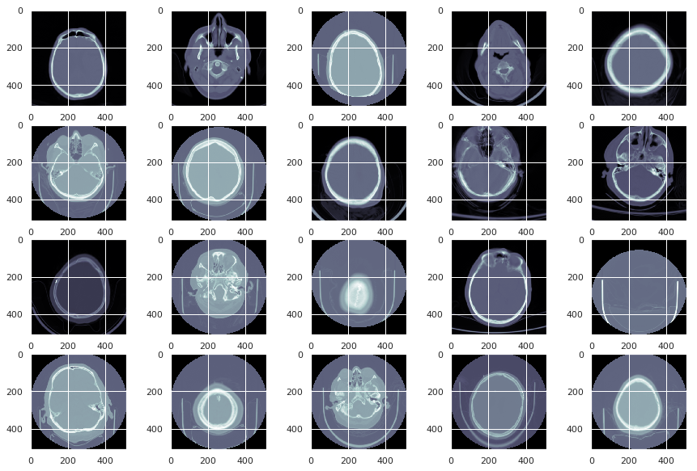
> Overview of DICOM files and medical images

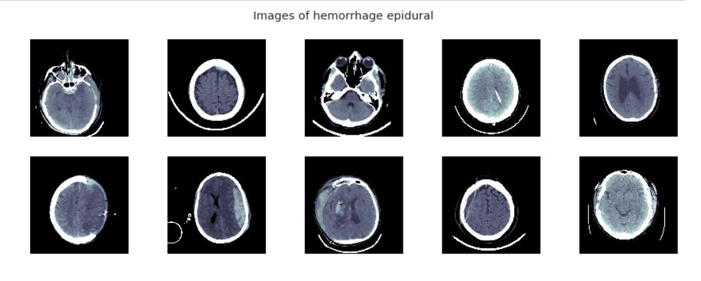
> Visualization of hemorrhage epidural

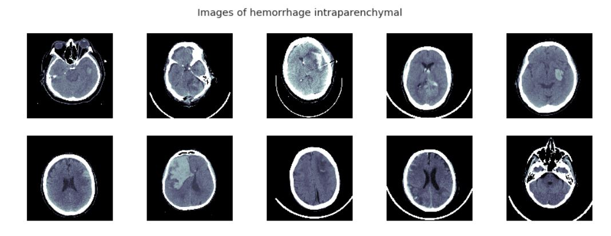
> Visualization of hemorrhage intraparenchymal

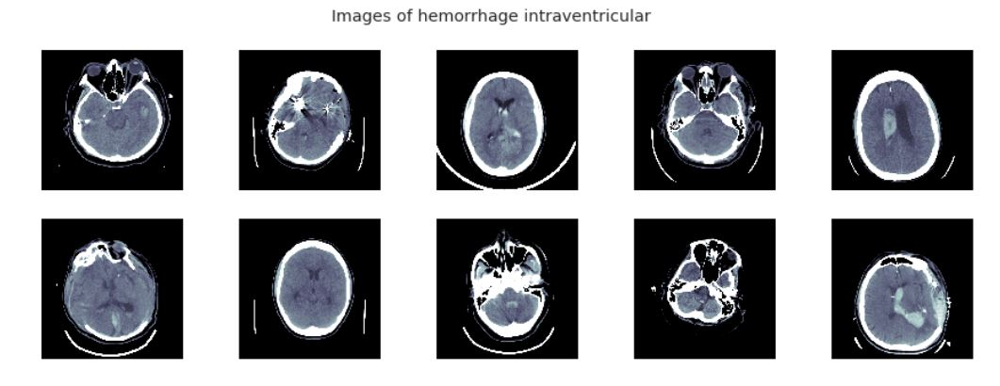
> Visualization of hemorrhage intraventricular

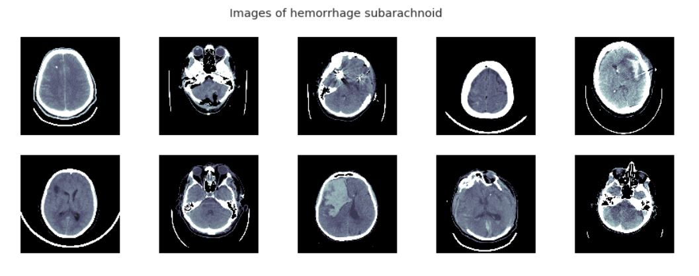
> Visualization of hemorrhage subarachnoid

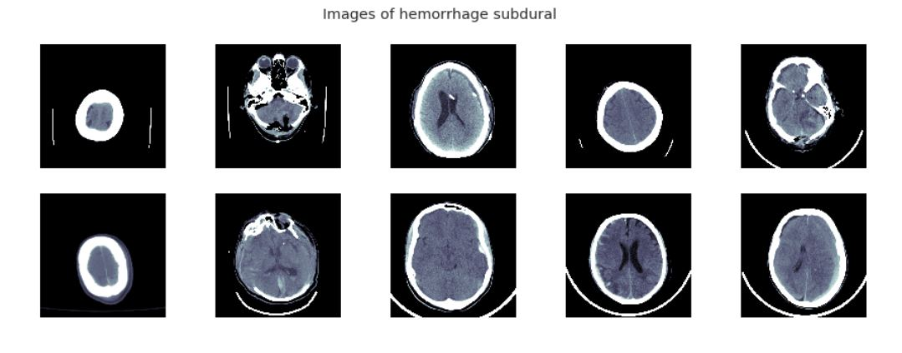
> Visualization of hemorrhage subdural

## Medical Description:

Intracranial hemorrhage (ICH) refers to acute bleeding inside your skull or brain. It’s a life-threatening emergency. You should go to the emergency room right away or call 911 if you think you or someone you know is experiencing ICH.

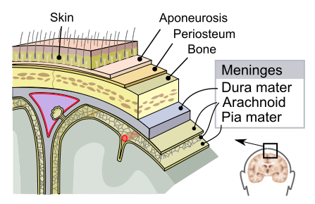

There are four types of ICH:

    Epidural Hematoma
    Subdural Hematoma
    Subarachnoid Hemorrhage
    Intracerebral Hemorrhage


> Subtypes Of Hemorrhage

### Epidural Hematoma

A hematoma is a collection of blood, in a clot or ball, outside of a blood vessel. An epidural hematoma occurs when blood accumulates between your skull and the outermost covering of your brain.

It typically follows a head injury, and usually with a skull fracture. High-pressure bleeding is a prominent feature. If you have an epidural hematoma, you may briefly lose consciousness and then regain consciousness.

### Subdural Hematoma:

A subdural hematoma is a collection of blood on the surface of your brain.

It’s typically the result of your head moving rapidly forward and stopping, such as in a car accident. However, it could also suggest abuse in children. This is the same type of movement a child experiences when being shaken.

A subdural hematoma is more common than other ICHs in older people and people with history of heavy alcohol use.

### Subarachnoid Hemorrhage:

A subarachnoid hemorrhage caused by a ruptured aneurysm. As blood fills the space between the brain and skull, a blood clot forms, causing increased pressure on the brain.

### Intracerebral Hemorrhage:

Intracerebral hemorrhage is when there’s bleeding inside of your brain. This is the most common type of ICH that occurs with a stroke. It’s not usually the result of injury.

A prominent warning sign is the sudden onset of neurological deficit. This is a problem with your brain’s functioning. The symptoms progress over minutes to hours. They include:

    headache
    difficulty speaking
    nausea
    vomiting
    decreased consciousness
    weakness in one part of the body
    elevated blood pressure

### For further information
Please review the narrative of our analysis in [our jupyter notebook](./acute-intracranial-hemorrhage-detection.ipynb)

For any additional questions, please contact **shaileshshettyd@gmail.com)

##### Repository Structure:
```
├── README.md                                                   <- The top-level README for reviewers of this project.
├── acute-intracranial-hemorrhage-detection.ipynb               <- narrative documentation of analysis in jupyter notebook
└── images                                                      <- both sourced externally and generated from code
```
